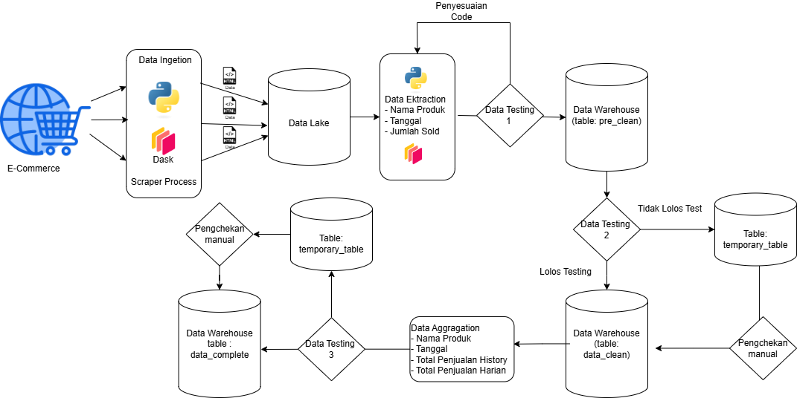

# STUDI KASUS 

## Soal

Salah satu issue dalam menggunakan external data source adalah terkadang didapat data yang tidak sesuai dengan ekspektasi, bisa jadi dikarenakan issue saat pengambilan data, atau berubahnya semantik dari sumber data tersebut tanpa pemberitahuan terlebih dahulu. Dalam kasus ini kita memiliki data untuk Q3 2024 yang berisi atribut berikut:

* Nama Produk
* Tanggal
* Total Penjualan Historis
* Total Penjualan Harian
  
Namun di akhir Q3 tim analis menemukan bahwa ada beberapa produk yang mengalami spike yang tidak wajar (tiba-tiba total penjualan historis mencapai ~10x lipat lalu turun lagi). Dengan issue tersebut Data Engineer perlu untuk mencari kemungkinan penyebab dari peningkatan tersebut apa, dan memberikan solusi (baik jangka pendek maupun panjang) untuk permasalahan ini. 

Bagaimana proses anda sebagai DE dalam mencari root cause issue ini dan bagaimana memitigasi case-case selanjutnya?
Apakah bila kenaikan tiba-tiba ini terjadi di tengah-tengah time series membutuhkan penanganan berbeda dengan bila peningkatan ini muncul di akhir sekali?
Bagaimana bila jumlah data untuk suatu produk sangat sedikit (hanya ada sampel 3-4 hari)?

Kamu diharapkan menuliskan jawaban dalam file README.md berisi ~500 kata dan juga code bila diperlukan (pseudocode, SQL, atau Python).

## Asumsi Kasus 
* Source Data : Data bersumber data E-Commerce yang diambil menggunakan metode scraper 
* Pengambilan Data Setiap Hari dari E-Commerce, karena di setiap product E-Commerce kita hanya dapat melihat Total Penjualan setiap harinya, oleh karena itu untuk menentukan nilai penjualan harian kita butuh membandingkan total terjual yang kita ambil di H-1 dan total terjual yang kita ambil pada H (Total Penjualan H - Total Penjualan H-1) untuk mendapatkan data total penjualan setiap harinya. 

## Masalah 
Terdapat 2 masalah utama pada kasus di atas

1. Problem 1: Perubahan data dari sumber
   * data yang tidak sesuai dengan expectation
   * perubahan semantik tanpa pemberitahuan

2. Problem 2 : Anomali Data
   * Peningkatan value yang drastis mencapai ~10x
     * Apakah  peningkatan  di tengah-tengah dan di Akhir time series membutuhkan penanganan berbeda?
     * bagaimana bila jumlah data untuk suatu product sangat sedikit? 

berikan solusi untuk jangka pendek maupun panjang

## Penyebab Masalah dan Solusi Singkat
1. Problem 1 

   * perubahan dari sumber external yang tidak bisa di kontrol oleh kita.
     * **solusi 1**: terlalu banyak kemungkinan perubahaan data yang bisa dilakukan oleh sumber, belum ada solusi pasti yang bisa dilakukan untuk memecahkan masalah ini akan tetapi kita bisa meminimalisir dan memitigasi masalah tersebut, dengan pengecheckan data quality.
     * **solusi 2**: untuk dapat memecahkan solusi banyak kemungkinan perubahaan data adalah dengan penggunaan AI khususnya LLM, yang dapat mengerti ketika perubahan terjadi, pendekatan LLM ini dapat menjadi solusi kedepannya untuk proses pengambilan data dari berbagai sumber dengan format yang berbeda. 

2. Problem 2
   ketika terjadi peningkatan value yang drastis, terdapat beberapa step solusi yang dapat dilakukan.
    * terjadi kesalahan ketika proses pengolahan data sebelumnya.
      * solusi jangka pendek: melakukan pengecheckan secara manual di setiap pipelinenya
      * solusi jangka panjang: 
        * membuat pipeline atau code yang lebih flexible untuk bebeberapa kemungkinan. 
        * menambahkan data quality testing untuk memverifikasi qualitas data. 
    * memang terjadi peningkatan signifikan karena suatu event atau tindakan penjualan lainnya, yang membuat penjualan meningkat
       * ketika sudah melakukan pengecheckan proses pengolahan data dan tidak ada proses yang salah, langkap selanjutnya adalah menganalisis secara manual, apakah pada moment tersebut sedang terjadi moment special atau event tertentu yang menyebabkan peningkatan penjualan.
    * kesalahan data dari sumber data (dari sumbernya memang seperti itu).
      * solusi jangka pendek: setelah di check dan tidak ada event special atau moment yang make sense untuk peningkatan yang significant, kita dapat asumsikan bahwa ada terjadi kesalahan pada system tersebut, solusi nya adalah menanyakan langsung pada pihak external terkait anomali data tersebut.
      * solusi jangka panjang: untuk mencegah kesalahan data dari sumber masuk ke ekosistem kita, kita dapat melakukan anomali testing untuk data yang memiliki outliar yang tidak masuk akal.
    * Apakah  peningkatan  di tengah-tengah dan di Akhir time series membutuhkan penanganan berbeda? sejujurnya kurang paham, konteks nya seperti apa.
    * bagaimana bila jumlah data untuk suatu product sangat sedikit? untuk product yang hanya sedikit, kita bisa melakukan pendekatan ke product yang kategori nya sama atau tidak jauh, untuk mengetahui apakah data tersebut anomali atau tidak. 

## Data Architecture Solution 

### Data Architecture Solution 1 

#### 1. Data Ingestion
ini merupakan proses pengambilan data dari source menggunakan metode scraper. 
Data Ingestion ini di desain untuk mengambil data mentah berhasil, bahkan ketika schema html berubah, tujuannya adalah **mengamankan data terlebih dahulu**
oleh karena itu pendekatan yang di ambil adalah kita coba untuk mengambil seluruh **data html**, pengambilan data seluruh HTML ini menjadi solusi untuk case nomor 1 yaitu perubahan data dari sumber.
dengan pengambilan data seluruh HTML terlebih dahulu ini, kita akan mengurangi terjadi nya kegagalan ketika pengambilan data.
tujuan pipeline ini adalah mengamankan data terlebih dahulu pada moment saat itu.

dalam proses ini kita akan melakukan pendekatan pararel computing menggunakan dask, metode ini sudah pernah dilakukan di perusahaan saya sekarang, dan terbukti meningkatkan kecepatan proses scraping, karena memungkinkan kita untuk mengambil dari dari berbagai url secara bersamaan.

#### 2. Data Extraction 
Opsi 1:
setelah data html masuk seluruhnya, kita akan meng ektract data tersebut untuk mengambil value nama, tanggal, jumlah sold.
dalam proses ini walaupun terdapat perubahan schema data dari sumber, setidaknya kita tidak melakukan proses scraping 2 kali, kita sudah menyimpan data nya terlebih dahulu. 

Opsi 2: 
Menggunakan LLM untuk meng extract data kita dari HTML, hal ini pernah dilakukan di company sekarang untuk mengextract berbagai jenis web, akan tetapi belum terselesaikan. 
dengan solusi ini, kita dapat mengextract dengan konsisten data dari website tanpa takut perubahaan struktur website atau bahkan dalam mengextract data dari berbagai web yang berbeda. 

#### 3. Data Testing 1 
melakukan testing
* VALUE DATA, apakah data yang masuk sesuai dengan ekspektasi yang di harapkan, misalkan range nilai yang mungkin dalam column A ini adalah 10.000 - 100.000 atau 
* FORMAT dan Type DATA, check apakah terdapat format data yang berubah.
* DUPLICATE, check apakah terdapat duplicate value 

apabila data tidak melewati proses testing, maka pipeline akan stop, dan harus dilakukan pengecheckan manual dan penyesuain code terlebih dahulu. 

data pun masuk ke data warehouse table pre_clean, dimana di table ini format data, value dan type data sudah sesuai

#### 4. Data Testing 2 
dalam proses ini, kita akan melakukan testing lebih lanjut. 
* ANOMALI DETECTION : untuk mengetahui apakah terdapat nilai data yang tidak wajar. 
* DUPLICATE FASE 2: proses pengecheckan ini kita menggunakan similarity checking, untuk mencegah data yang duplicate akan tetapi memiliki value yang sedikit berbeda. 

#### 5. Data Aggregation and Combine
melakukan aggregation dan penambahan data dengan data hari sebelumnya 

#### 6. Data Testing 3 
* Outliar Checking : setelah data disatukan, apakah data baru memiliki data outliar terhadap seluruh data. 